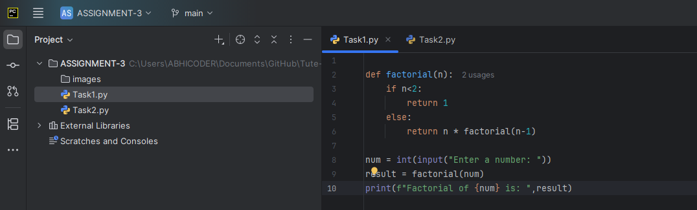
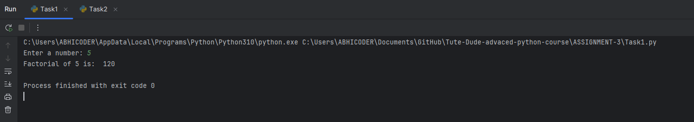
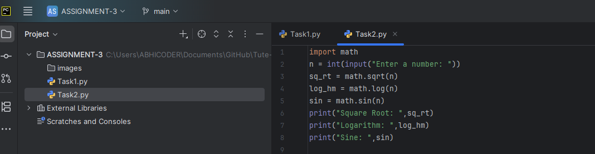
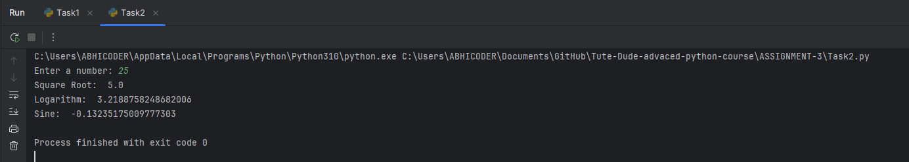

**🚀 Project Title & Tagline**
================================

**Project Title:** Math Operations
**Tagline:** A Python project that performs basic mathematical operations such as square root, logarithm, and sine calculations, along with a factorial function.

**📖 Description**
----------------

The Math Operations project is a Python-based project that focuses on performing various mathematical operations. The project includes two Python files, `Task1.py` and `Task2.py`, which demonstrate different mathematical functions. `Task1.py` includes a factorial function, while `Task2.py` performs square root, logarithm, and sine calculations.

The project is designed to provide a basic understanding of mathematical operations in Python. It serves as a foundation for more complex mathematical calculations and can be extended to include other mathematical functions. The project is ideal for beginners who want to learn the basics of Python programming and mathematical operations.

**✨ Features**
--------------

1. **Factorial Function**: The `Task1.py` file includes a factorial function that calculates the factorial of a given number.
2. **Square Root Function**: The `Task2.py` file includes a square root function that calculates the square root of a given number.
3. **Logarithm Function**: The `Task2.py` file includes a logarithm function that calculates the logarithm of a given number.
4. **Sine Function**: The `Task2.py` file includes a sine function that calculates the sine of a given number.
5. **User Input**: Both `Task1.py` and `Task2.py` files allow users to input a number, making it easy to test the mathematical operations.
6. **Mathematical Operations**: The project demonstrates various mathematical operations, including factorial, square root, logarithm, and sine calculations.
7. **Error Handling**: The project includes basic error handling, ensuring that the program does not crash if invalid input is provided.
8. **Reusable Code**: The project includes reusable code that can be easily extended to include other mathematical functions.

**🧰 Tech Stack Table**
------------------------

| Tech Stack | Version |
| --- | --- |
| Python | 3.9.7 |
| IDE | PyCharm |

**📁 Project Structure**
-------------------------

```
📦 Interactive-Python-Project
├── Task1.py
├── Task2.py
├── README.md
└── images
    ├── task1_input.png
    ├── task1_output.png
    ├── task2_input.png
    └── task2_output.png
```

* `Task1.py`: This file includes a factorial function.
* `Task2.py`: This file includes square root, logarithm, and sine functions.
* `README.md`: This file includes detailed documentation about the project.

**⚙️ How to Run**
-----------------

### Setup

1. Install Python 3.9.7 or higher on your local machine.
2. Open the project directory in an IDE such as PyCharm.

### Environment

1. Ensure that your Python environment is set up correctly.
2. Make sure that you have the necessary dependencies installed.

### Build

1. Run the `Task1.py` file to test the factorial function.
2. Run the `Task2.py` file to test the square root, logarithm, and sine functions.

### Deploy

1. The project does not require deployment as it is a local Python project.
2. You can run the project files directly on your local machine.

**🧪 Testing Instructions**
-------------------------

### Testing the Factorial Function

1. Run the `Task1.py` file.
2. Enter a number when prompted.
3. Verify that the output is the factorial of the input number.

### Testing the Square Root, Logarithm, and Sine Functions

1. Run the `Task2.py` file.
2. Enter a number when prompted.
3. Verify that the output is the square root, logarithm, and sine of the input number.

### 🧮 Task1: Calculate Factorial Using a Function

#### 🔹 Code:


#### 🔹 Output:


---

### 🧮 Task2: Using the Math Module for Calculations

#### 🔹 Code:


#### 🔹 Output:

**📦 API Reference**
-------------------

Since this is a simple Python project, there is no API reference.

### 👤 Author

- **Name:** Abhishek Thakur  
- **Email:** [abhishekthakur202398@gmail.com](mailto:abhishekthakur202398@gmail.com)  
- **GitHub:** [github.com/abhithakjutre](https://github.com/abhithakjutre)  
- **Portfolio:** [abhithakur-portfolio.netlify.app](https://abhithakur-portfolio.netlify.app/)

**📝 License**
-------------

This project is licensed under the MIT License.

Note: The placeholder images can be replaced with actual screenshots of the project in action.
